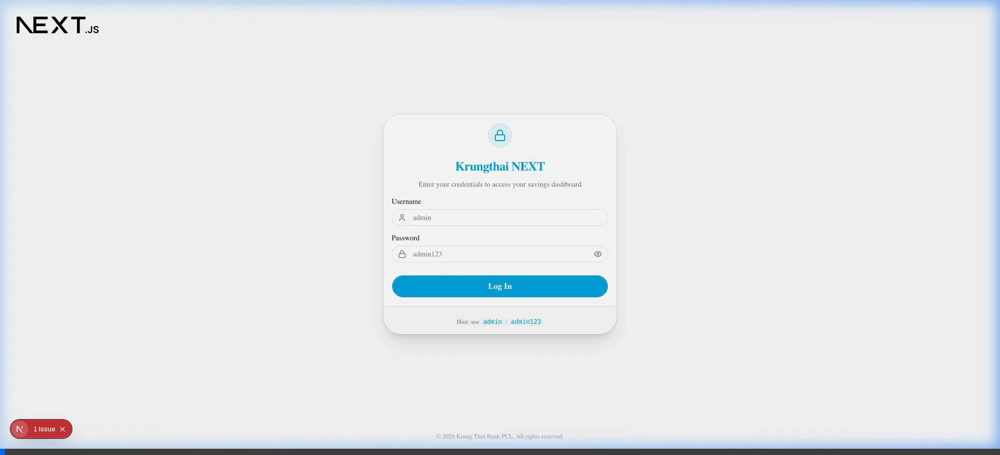

# UI Test Walkthrough

This walkthrough demonstrates the UI flow from login to dashboard interactions, specifically focusing on the DCA calculator and image modal functionality.

## Test Summary

- **Login**: Successful login with `admin`/`admin123`.
- **DCA Interactions**: Increased monthly contribution and verified dynamic graph updates.
- **Image Modal**: Expanded a wire transfer proof image and verified the modal closure.

## Video Recording

## Key Observations

1. **Dynamic Scaling**: The DCA projection graph automatically adjusts its Y-axis as contribution amounts change (increased from ฿5,000 to ฿8,000).
2. **Interactive Modals**: Clicking on proof images opens a clean modal view for detailed inspection.
3. **Smooth Transitions**: The transition from login to the dashboard is rapid and responsive.
